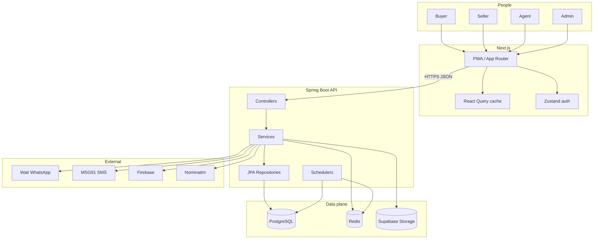
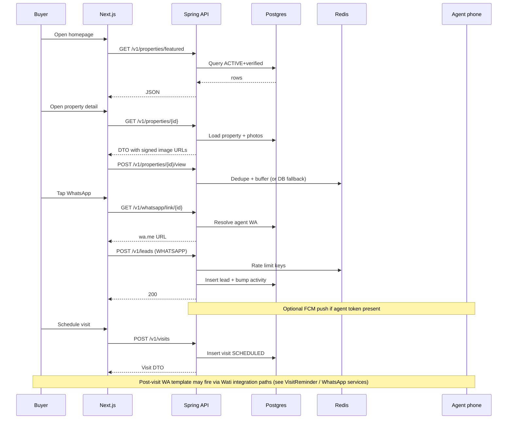
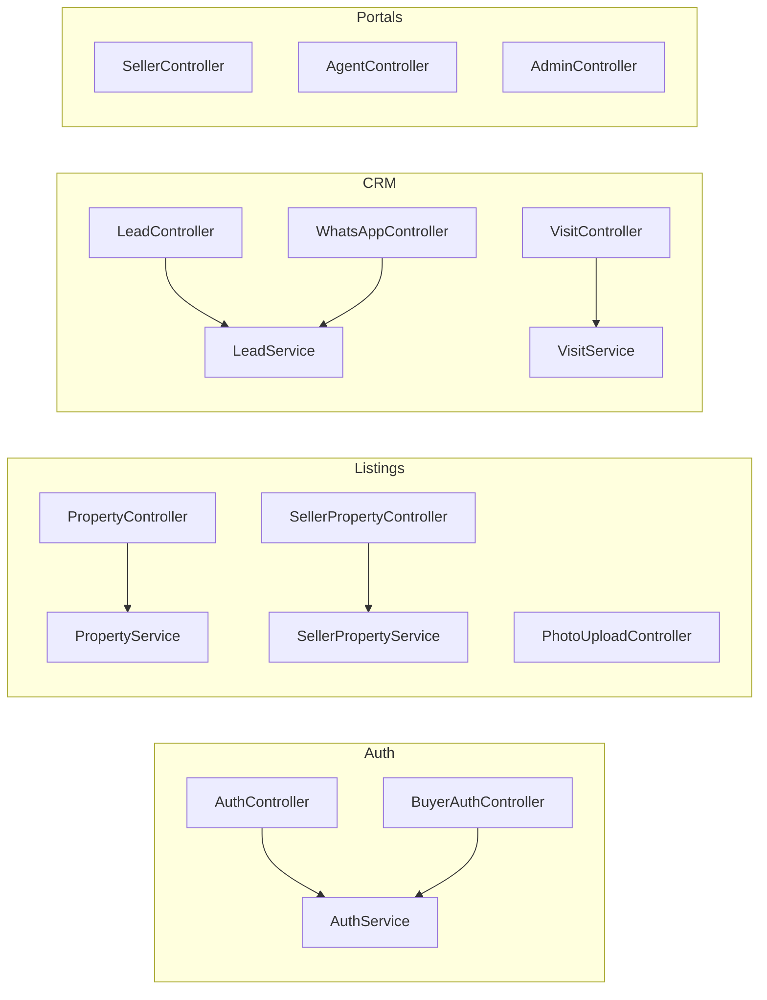

# ListMyNest — Architecture Diagrams (Mermaid)

> Render in GitHub, VS Code Mermaid preview, or any Mermaid-compatible viewer.

---

## System context

---

## Buyer journey (happy path — simplified)

---

## Domain modules (backend)

---

*For narrative detail see `SYSTEM_DESIGN.md`. For risks see `PRODUCTION_READINESS.md`.*
